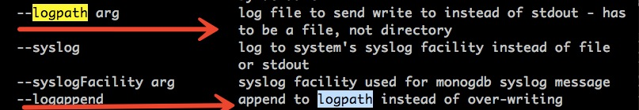
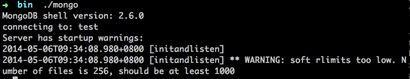
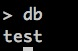
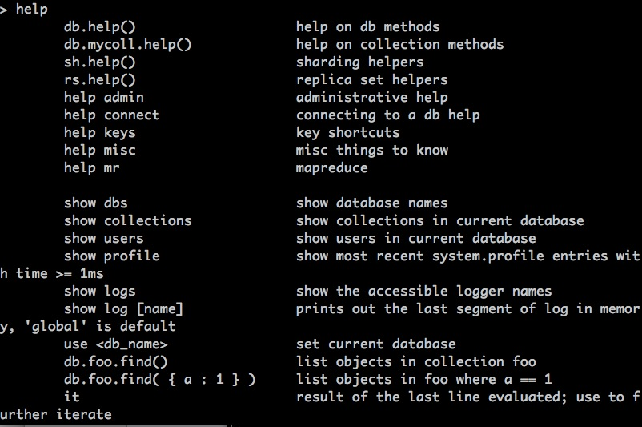
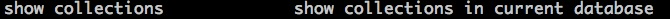

# 全栈系列之 MongoDB 中级篇

## 简介

其实相比 **初级篇** ，中级篇里面我们一方面会比较深入地去看看类似查询的方式方法。


### 多维度的查询

#### find

前面我们简单介绍了一下find的第一个参数，它其实就是一个文档，用来做筛选条件

实例1：

```shell
//welcome to join us: http://www.wandoujia.com/join
db.wandoujia.jobs.find()
```

实例2：

```shell
//welcome to join us: http://www.wandoujia.com/join
db.wandoujia.jobs.find({"category", "fe" , "level" : 2})
```


那么其实我们日期查询里面都有一些对返回的查询结果需要指定或者过滤掉一些无用的键值，如何处理呢？

实例1 ：

```shell
db.wandoujia.jobs.find({} , {"category" : 1, "base" : 1})
```

实例2 ：

```shell
db.wandoujia.jobs.find({} , {"level" : 0})
```

上面这段其实我们看到：

1. find可以指定第二个参数
2. 可以只返回第二个参数文档里面指定的字段，这里对应的值是 1
3. 剔除查询结果里面的某个键的化，对应的值设置为 0 就可以了

这样的好处其实很明显啦：

1. 减少数据的大小
2. 节省传输的数据量
3. 客户端也能减少解码文档的时间和内存消耗


#### 查询条件

其实我们日常为了做到精确定位，会指定一些查询条件，比如：

1. <
2. <=
3. >
4. >=
5. !=

那在MongoDB里面用什么来表示这些比较操作符呢？

1. $lt
2. $lte
3. $gt
4. $gte
5. $ne


我们直接看一个实例：

```shell
//比如我们找工作有的人只看2级到3级的
db.wandoujia.jobs.find({"level" , {"$gte" : 2, "$lte" : 3})
```

这里，我们给find传递了一个内嵌文档，内层的文档的key就是$gte和$lte


实例2：

```shell
//比如我们找工作有的人不看帝都的
db.wandoujia.jobs.find({"base" , {"$ne" : "beijing"})
```

这里，$ne就代表*不等于*


所以大致的规则：

1. $lt、$lte、$gt、$gte、$ne都是以$开头，这也验证了我们前面为什么在命名其他的时候不推荐使用 *$*
2. $lt、$lte、$gt、$gte、$ne这些一般都在内层文档里面


### 管理MogoDB

其实大家看了很多之后，一定比较想自己动手，去实践一下这些操作。

#### 启动

一般都是作为网络服务器来运行的，客户端可以连接到这个服务器上。

1. 命令行

```shell
./mongod
```

我这里并没有指定任何参数，其实可以从

```shell
./mongod -h
```

控制台会打出一堆的帮助命令，还是很多的，我这边只是简单提几个：

- --dbpath


可以指定数据目录，默认都是/data/db(根目录下的)，每一个mongod实例都需要独立的数据目录。而且当mongod启动的时候，数据里面里面都创建一个mongod.lock的文件，防止其他mongod进程来使用这个数据目录。

感兴趣的化，大家可以自己打开对应的数据目录看看。


- --logpath 和 --logappend



可以指定日志输出的路径，而且最好配合logappend，大多数情况下，我们还是希望保留原来的日志，做加法，而不是覆盖。

- -f


可以指定某个配置文件来加载命令

那配置文件的书写有没有什么要求呢？

```shell
# config by yaochun 2013-08-07 pm 07:10
logpath = mongodb.log 
```

* 一般都是#开头的注释
* 注意大小写


当然里面还有很多其他有用的设置，比如：

- port
- jsonp
- ipv6
- noauth
- rest
- httpinterface

等等，有需求的可以直接去看 -h 里面的说明。


### MongoDB客户端

服务器启动后，我们需要一个客户端来操作，那么这个客户端是什么呢？




看图上，我们在命令行输入了以下命令：

```shell
./mongo
```

它就是MongoDB shell，也是一个js shell，可以完成与MongoDB实例的交互

注释：其实如果你只是想体验js shell的化，可以输入：

```shell
./mongo --nodb
```

这样的化，就不会连接数据库。


它默认会自动连接到服务器的test数据库，并把这个数据库连接赋值给全局的db变量

如图：


当然如果你希望有帮助文档来看看里面到底有什么命令，可以输入：

```shell
help
```

如图：


一般常用的：

* show dbs

返回当前所有的数据库名称
如图：

* show collections

返回当前数据库里面的所有集合（注意：里面包含system.* 这个系统的集合）

* use wandoujia

比如我现在默认进去在test这个数据库，我现在要切换到wandoujia这个数据库

如图：

* db.fe 

这样就能访问上面进入的wandoujia这个数据库的fe集合

* shell执行插入

```shell
use wandoujia
db.fe.insert({ "name" : "yourname" })
```

这样wandoujia这个数据库的fe集合里面就多了一个文档

* shell执行查询

```shell
db.fe.find()
```

会返回包含刚才插入的那个文档的集合。

* shell执行更新

```shell
db.fe.update( { "name" : "yourname" }, { "name" : "yourname", "recommender" : "yaochun" })
```

update至少接受两个参数，第一个是限定条件对应的文档，第二个是新的文档。

你测试后会发现，其实这个更新就是第二个新文档直接覆盖第一个，当然你可以先定义一个变量，这样update的时候，去修改那个变量，然后传递给update就不需要这样写了。


* shell执行删除

```shell
db.fe.remove({ "recommender" : "yaochun" })
```


### 强大的聚合工具

其实简单地讲：计算一些集合里面文档的个数


#### count

返回某个集合文档的个数


```shell
//比如现在wandoujia一共的员工数目
db.wandoujia.staff.count()
```

那比如我就像知道fe-team里面的人员个数呢？

```shell
//比如现在wandoujia一共的员工数目
db.wandoujia.staff.count({ "category" : "fe" })
```
